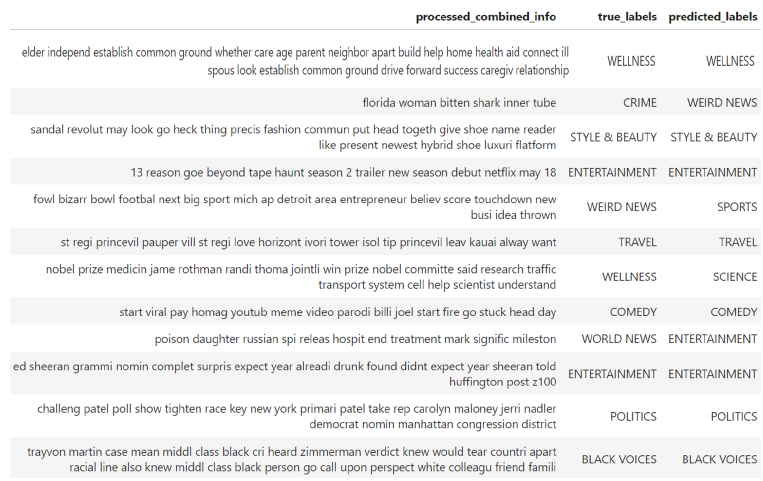

# NLP_to_Categorize_News_Articles

This is my final AIT (Artificial Intelligence Techniques) Project which was NLP (Natural Language Processing) classification using the HuffPost dataset in Kaggle. Included are the following files:

1. [The final report](NLP%20Final%20Project%20Report.pdf)
2. [The final presentation](NLP%20Final%20Presentation.pdf)
3. [The code for the final report](NLP%20Final%20Project%20Code.ipynb)
4. [The code for the undersampling evaluation](NLP%20Undersampling%20Evaluation%20Code.ipynb)
5. [The code for the Midsemester baseline](NLP_Project_Midsemester.ipynb)

HTML files of the code are also available for download in this repository. 
Below are extracts from the final report for a quick reference of the project and results. Refer to the final report for more details.

### Abstract
We live in a digital age, in which vast quantities of news and other content can be accessed and consumed online. Accurately categorizing all this content and recommending
it to online users is a difficult challenge. In the past decade, Natural Language Processing (NLP) techniques have become necessary to classify online articles, based on their
content.

This project utilizes the News Category Dataset from HuffPost [1]. It contains new
headlines from approximately 210,000 articles that span a decade from 2012 to 2022.

The project uses NLP algorithms to categorize the headlines into 42 distinct article categories. This midsemester report summarizes the work done up to that point on the project.
Extensive exploratory data analysis reveals insights into the data’s structure. There is
a notable class imbalance in this dataset that will be further investigated. The dataset
has been processed and prepared for simpler machine learning models which serve as a
baseline. This includes the implementation of TF-IDF vectorization. The two baseline
models are Naïve Bayes and Logistic Regression, which have achieved classification
accuracies of 52.5% and 60.5% respectively for the 42-class dataset.

The next stage of the project focused on further enhancing the data preparation and
utilizing advanced deep learning models including Gated Recurrent Unit (GRU) and
Long Short-Term Memory (LSTM) models. By merging some similar categories, the
number of classes was reduced to 31, which resulted in a significant improvement in
accuracy. The GRU and LSTM models were developed and tuned, and both resulted in
improving the prediction accuracy over the baseline Logistic Regression model. The best
accuracy was achieved by the GRU. The best overall classification accuracy was 69.3%
which is a significant improvement over the baseline of 60.5%. This project has demonstrated that neural networks are better suited to NLP tasks than traditional models, but
feature engineering and data preparation play an even more important role in improving
classification accuracy.

### Introduction
In the digital age of today, vast quantities of updated information and news are available to
us constantly. For someone interested in reading the latest developments or researching past
articles on a particular topic, the news article must first be categorized so that it can easily be
identified as content that might be of interest and recommended to the user. With millions of 
news articles available online, researching, categorizing, and filtering through such quantities
is impractical for a human to do. Natural language processing (NLP) is required to categorize
these articles.
NLP is a branch of Artificial Intelligence (AI) concerned with training machines to read,
understand, interpret, and generate spoken and written human languages in a similar way
that humans can [2]. In NLP, algorithms are developed to process large amounts of language
data such as articles or documents, from which practical meaning and information can be
retrieved.
One common and important application of NLP is article classification or categorization.
This project is concerned with article classification. A news category dataset with over
200,000 article headlines and descriptions will be used in this project. The aim is to read and
interpret the headlines and descriptions and categorize them into one of 42 topic categories.
To achieve this, the project will be divided into several steps.
1. **Literature Review:** A literature review will be conducted to research existing methods
and models used in NLP for article classification as well as possible challenges
and limitations. The idea is to deploy a baseline first and then use more advanced
techniques to find the optimal solution to this challenge.
2. **Exploratory Data Analysis (EDA):** The dataset will be investigated to determine
what insights can be gained from it and to determine its quality and current suitability
to be used for this NLP project. Data wrangling will be performed to make the dataset
more suitable for the project.
3. **Data Preparation:** The text data will be cleaned, pre-processed and vectorized (word
embedded) to prepare it for the machine learning stage.
4. **Establish a Baseline:** A baseline model will be established to demonstrate the suitability
of this dataset in the field of article classification.
5. **Identification of Challenges, and Improvement in Data Preparation:** Issues faced
will be addressed and further techniques will be investigated to improve the data preparation
to improve the modelling performance.
6. **Deployment of More Advanced Models and Techniques:** The literature review has
identified several advanced algorithms that can be used in topic modelling. This step
and the previous will be used and refined testing various of these more advanced model
architectures to improve the news article classification accuracy.

### Example of Results
Figure 1 shows a sample of the true and predicted labels and the ‘processed_combined_info’
column which was vectorized before machine learning. Stemming was chosen as a preprocessing
step, so some words appear strange when reduced to their stems. In most cases in
this example, the model predicted the correct category. In the mispredicted labels, reading
them and making sense of the text, it can be easy to see why some labels were mispredicted.

**Row 2:** Crime was mispredicted as Weird News, likely due to a woman being bitten by a
shark. This seems like something weird and not a crime.

**Row 5:** The true label of Weird News can easily be confused with Sports because of the
words football, sport and touchdown.

**Row 7:** Also, Wellness was classified as Science and it can easily be seen why as the Nobel
prize for medicine is mentioned.

**Row 9:** The example ofWorld News being predicted as Entertainment is clearly a bad classification.
This is likely due to the words ‘Russian spy” often being a popular theme in movies.
These examples highlight the difficulty even for humans to categorize the brief headlines
and descriptions correctly. Considering these examples, I would consider a classification
accuracy of over 69% to be a good result. Undoubtedly reading the full article would have
helped enormously in providing more accurate context, which would result in higher classification
accuracy.

  

<b>Figure 1 – Sample Output of True and Predicted Labels</b>

### Conclusion
This was a comprehensive natural language processing project, in which several techniques
of data preparation, data preprocessing and machine learning were evaluated and tested to
produce a comprehensive report and gain a better understanding of all important aspects involved
in natural language processing. Extensive Exploratory Data Analysis was carried out
to gain a better understanding of the dataset. Thorough feature engineering and data preparation
were performed including the many steps required in data preprocessing to prepare
the text optimally for the machine learning process. A baseline was successfully created
using Naïve-Bayes and Logistic Regression models. With these models in place, further
optimization of the text preprocessing was performed in the baseline.  

With the optimized preprocessing, the best baseline model was a Logistic Regressor
which had an overall accuracy of 60.51%. Stage 2 of the project was to employ further
feature engineering and modelling techniques to improve upon the baseline.

It was observed that of the 42 categories of news articles, several were very similar
which would lead to common misclassifications. After careful consideration, several categories 
were merged, leaving 31 categories of news articles. This provided a significant
improvement of the baseline, with the overall accuracy with the same logistic regression
model improving to 66.45%. This large increase underscores the importance of good data
preparation, which usually results in larger gains than implementing a more advanced model.

An attempt was made to balance the dataset by drastically reducing the majority classes
by employing under-sampling techniques. Although the recall improved slightly, the overall
accuracy fell substantially so it was concluded to not implement under-sampling on this NLP
project. Too much valuable information had been lost in the dataset reduction.

Finally, a GRU and an LSTM model were built using Keras and various configurations
of the architecture, hyperparameters and word embedding techniques were investigated. The
word embedding techniques of GloVe and Word2Vec slightly degraded the performance of
the two RNN models. A standard tokenization and sequence padding technique proved to
work best for this configuration.

The best accuracy achieved was 69.32% using the GRU model. Despite the more complex
design of the LSTM model, the GRU model consistently performed better by about 1%
on overall accuracy and in the other accuracy metrics too. Additionally, there are still further
architectural designs and hyperparameter setting combinations that can be explored further,
possibly leading to better LSTM results.

Although my testing was extensive, it is certainly not 100% complete. Several more
avenues could be explored given sufficient time.

This project proved to be very interesting and a great learning experience for me. There
are still many areas of exploration left for this project to improve upon the results. Many
of those mentioned in the "Scope of Continuing" Work section could not be carried out due
to time constraints and lack of processing power. Hyperparameter tuning, further work with
word embedding techniques and evaluation of more advanced pre-trained models such as
BERT and DistilBERT and even ensemble methods are all areas worthy of further exploration.
To summarize, an improvement from 60.5% to 69.3% is considerable and various
methods were integrated together to achieve this solid gain.

